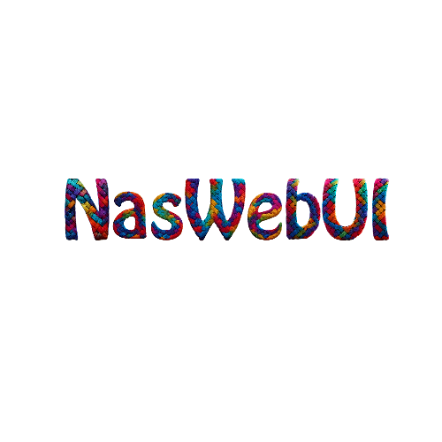

# NasWebUI

[](https://github.com/nastech-ai/NasWebUI/actions/workflows/ci-self-hosted.yml)
[](https://github.com/nastech-ai/NasWebUI/actions/workflows/tests.yml)
[](https://github.com/nastech-ai/NasWebUI/actions/workflows/browser-smoke.yml)
[](https://github.com/nastech-ai/NasWebUI/actions/workflows/docker-smoke.yml)
[](https://github.com/nastech-ai/NasWebUI/actions/workflows/native-windows-startup.yml)
[](https://github.com/nastech-ai/NasWebUI/actions/workflows/release.yml)


<p align="center">
  
</p>


  **NasWebUI** is the official web interface for [NasTech AI Agent](https://github.com/nastech-ai/NasTech-Agent) — a powerful, locally-run AI assistant by **NasTech AI**.

  NasWebUI gives you a full-featured browser UI for multi-turn conversations, file browsing, task management, and agent monitoring — all running on your own machine.

  ---

  ## Features

  - **Chat interface** — Multi-turn conversations with full message history
  - **Task & Kanban boards** — Plan and track work alongside your AI agent
  - **Skills browser** — Explore and invoke agent skills from the UI
  - **Memory panel** — View and manage agent memory state
  - **Workspace explorer** — Browse and open files in your working directory
  - **Agent health & logs** — Live agent process monitoring and log streaming
  - **Profiles** — Multiple agent profile support
  - **PWA** — Install as a Progressive Web App for desktop-class experience
  - **Super AMOLED black theme** — True #000000 glassy dark theme, perfect for OLED/AMOLED displays
  - **16+ themes/skins** — Default (gold), Neon, Zeus, Verdigris, AMOLED, and more

  ---

  ## Requirements

  - Python 3.10+
  - [NasTech Agent](https://github.com/nastech-ai/NasTech-Agent) installed and accessible

  ---

  ## Quick Start

  ### 1. Install NasTech Agent

  ```bash
  bash <(curl -fsSL https://raw.githubusercontent.com/nastech-ai/NasTech-Agent/main/install.sh)
  ```

  ### 2. Clone NasWebUI

  ```bash
  git clone https://github.com/nastech-ai/NasWebUI.git
  cd NasWebUI
  ```

  ### 3. Install Python dependencies

  ```bash
  pip install -r requirements.txt
  ```

  ### 4. Start the server

  ```bash
  python server.py
  ```

  Then open [http://localhost:8787](http://localhost:8787) in your browser.

  ---

  ## Configuration

  Copy `.env.example` to `.env` and edit as needed:

  ```bash
  cp .env.example .env
  ```

  | Variable | Description | Default |
  |---|---|---|
  | `NASMUSICUI_HOST` | Bind address | `127.0.0.1` |
  | `NASMUSICUI_PORT` | Port | `8787` |
  | `NASMUSICUI_AGENT_DIR` | Path to NasTech-Agent checkout | auto-discovered |
  | `NASMUSICUI_STATE_DIR` | Session/state storage | `~/.nastech/webui` |
  | `NASTECH_HOME` | NasTech home directory | `~/.nastech` |
  | `NASTECH_CONFIG_PATH` | Path to config.yaml | `~/.nastech/config.yaml` |
  | `NASMUSICUI_DEFAULT_MODEL` | Default model override | agent default |
  | `NASMUSICUI_BOT_NAME` | Display name for the assistant | `NasTech` |

  ---

  ## AMOLED Theme

  NasWebUI ships with a **Super AMOLED black glassy theme** — the default signature skin for NasTech.

  To activate it, open **Settings → Appearance → Skin** and select **AMOLED**.

  The AMOLED skin features:
  - True `#000000` backgrounds for maximum pixel-off savings on OLED screens
  - Glass-morphism surfaces with `backdrop-filter: blur`
  - Cyan (`#00DCFF`) accent throughout
  - Rounded pill-shaped composer input
  - Glowing send button and session highlights

  ---

  ## Agent Discovery

  NasWebUI auto-discovers your NasTech Agent installation by checking these paths in order:

  1. `NASMUSICUI_AGENT_DIR` environment variable
  2. `NASTECH_HOME/NasTech-Agent/run_agent.py` (default: `~/.nastech/NasTech-Agent`)
  3. `../NasTech-Agent/run_agent.py` (sibling directory)
  4. `~/NasTech-Agent/run_agent.py`
  5. `nastech` CLI on `$PATH`

  ---

  ## Development

  ```bash
  # Run with auto-reload
  NASMUSICUI_HOST=0.0.0.0 NASMUSICUI_PORT=5000 python server.py
  ```

  Static assets live in `static/`. Backend API routes are in `api/`.

  ---

  ## License

  MIT License — Copyright (c) 2025 NasTech AI Agent Contributors

  ---

  ## Links

  - [NasTech Agent](https://github.com/nastech-ai/NasTech-Agent)
  - [NasWebUI Repository](https://github.com/nastech-ai/NasWebUI)
  
